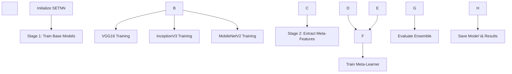

\# System Architecture


\## Table of Contents

\- \[Overview](#overview)

\- \[Architecture Design](#architecture-design)

\- \[Component Details](#component-details)

\- \[Data Flow](#data-flow)

\- \[Model Architecture](#model-architecture)

\- \[Deployment Architecture](#deployment-architecture)


---


\## Overview


The Alzheimer's Disease MRI Classification system uses a \*\*Stacked Ensemble Transfer Neural Network (SETNN)\*\* approach, combining three powerful pre-trained CNN architectures through meta-learning to achieve state-of-the-art classification accuracy.


\### Key Design Principles


1\. \*\*Modularity\*\*: Each component is self-contained and independently testable

2\. \*\*Scalability\*\*: Designed to handle large-scale datasets and batch processing

3\. \*\*Maintainability\*\*: Clear separation of concerns with well-documented interfaces

4\. \*\*Extensibility\*\*: Easy to add new models or modify existing components

5\. \*\*Production-Ready\*\*: Includes monitoring, logging, and error handling


---


\## Architecture Design


\### High-Level Architecture


```

┌─────────────────────────────────────────────────────────────┐

│                     User Interface Layer                     │

│  ┌──────────┐  ┌──────────┐  ┌──────────┐  ┌──────────┐   │

│  │ REST API │  │ Web UI   │  │ CLI      │  │ Notebooks│   │

│  └──────────┘  └──────────┘  └──────────┘  └──────────┘   │

└─────────────────────────────────────────────────────────────┘

&nbsp;                          │

┌─────────────────────────────────────────────────────────────┐

│                    Application Layer                         │

│  ┌──────────────┐  ┌──────────────┐  ┌──────────────┐     │

│  │  Inference   │  │   Training   │  │  Evaluation  │     │

│  │   Pipeline   │  │   Pipeline   │  │   Pipeline   │     │

│  └──────────────┘  └──────────────┘  └──────────────┘     │

└─────────────────────────────────────────────────────────────┘

&nbsp;                          │

┌─────────────────────────────────────────────────────────────┐

│                      Model Layer                             │

│  ┌────────────┐  ┌────────────┐  ┌────────────┐           │

│  │   VGG16    │  │ InceptionV3│  │ MobileNetV2│           │

│  │ (Base #1)  │  │ (Base #2)  │  │ (Base #3)  │           │

│  └────────────┘  └────────────┘  └────────────┘           │

│                      │      │      │                        │

│              ┌───────┴──────┴──────┴────────┐              │

│              │    Meta-Learner (LogReg)     │              │

│              │    SETNN Ensemble Model       │              │

│              └──────────────────────────────┘              │

└─────────────────────────────────────────────────────────────┘

&nbsp;                          │

┌─────────────────────────────────────────────────────────────┐

│                       Data Layer                             │

│  ┌──────────────┐  ┌──────────────┐  ┌──────────────┐     │

│  │Preprocessing │  │ Augmentation │  │   Dataset    │     │

│  │   Pipeline   │  │   Pipeline   │  │   Loader     │     │

│  └──────────────┘  └──────────────┘  └──────────────┘     │

└─────────────────────────────────────────────────────────────┘

&nbsp;                          │

┌─────────────────────────────────────────────────────────────┐

│                     Storage Layer                            │

│  ┌──────────────┐  ┌──────────────┐  ┌──────────────┐     │

│  │  Raw Data    │  │  Processed   │  │   Models     │     │

│  │  (NIfTI)     │  │  Data (NPY)  │  │  \& Results   │     │

│  └──────────────┘  └──────────────┘  └──────────────┘     │

└─────────────────────────────────────────────────────────────┘

```


---


\## Component Details


\### 1. Data Processing Components


\#### MRIPreprocessor (`src/data/preprocessing.py`)


\*\*Responsibilities:\*\*

\- Load NIfTI format MRI scans

\- Extract 2D slices from 3D volumes

\- Noise removal and background subtraction

\- Intensity normalization

\- Image resizing and format conversion


\*\*Key Methods:\*\*

```python

\- load\_nifti(path) -> np.ndarray

\- extract\_middle\_slice(volume, axis) -> np.ndarray

\- normalize\_intensity(image) -> np.ndarray

\- process\_nifti\_file(path) -> np.ndarray

```


\*\*Input:\*\* NIfTI files (.nii, .nii.gz)  

\*\*Output:\*\* Preprocessed numpy arrays (224x224x3)


\#### MRIAugmentor (`src/data/augmentation.py`)


\*\*Responsibilities:\*\*

\- Apply data augmentation for training

\- Geometric transformations (rotation, flip, shift)

\- Intensity transformations (brightness, contrast)

\- Noise addition and quality degradation simulation


\*\*Augmentation Techniques:\*\*

\- Rotation (±20°)

\- Horizontal/Vertical flips

\- Zoom/Scale (0.8-1.2x)

\- Brightness adjustment

\- Gaussian noise

\- Elastic transformations


\#### ADNIDataset (`src/data/dataset.py`)


\*\*Responsibilities:\*\*

\- Load and organize dataset splits

\- Create TensorFlow data pipelines

\- Apply preprocessing and augmentation

\- Handle batch generation


\*\*Dataset Structure:\*\*

```

data/processed/

├── train/

│   ├── Non\_Demented/

│   ├── Mild\_Cognitive\_Impairment/

│   └── Alzheimers\_Disease/

├── val/

└── test/

```


---


\### 2. Model Components


\#### Base Models (`src/models/base\_models.py`)


Three pre-trained CNN architectures with transfer learning:


\*\*VGG16:\*\*

\- \*\*Architecture:\*\* 16 layers, consistent 3x3 conv filters

\- \*\*Strengths:\*\* Deep feature extraction, proven architecture

\- \*\*Fine-tuning:\*\* Last 4 layers trainable

\- \*\*Parameters:\*\* ~14.7M (total), ~7.6M (trainable)


\*\*InceptionV3:\*\*

\- \*\*Architecture:\*\* Multi-scale feature learning with inception modules

\- \*\*Strengths:\*\* Efficient computation, captures features at multiple scales

\- \*\*Fine-tuning:\*\* Last 50 layers trainable

\- \*\*Parameters:\*\* ~21.8M (total), ~16.2M (trainable)


\*\*MobileNetV2:\*\*

\- \*\*Architecture:\*\* Inverted residuals with linear bottlenecks

\- \*\*Strengths:\*\* Lightweight, efficient for deployment

\- \*\*Fine-tuning:\*\* Last 30 layers trainable

\- \*\*Parameters:\*\* ~2.2M (total), ~1.3M (trainable)


\#### SETNN Ensemble (`src/models/setnn.py`)


\*\*Architecture Overview:\*\*

```

Input (224x224x3)

&nbsp;   ↓

┌───┴───────┬──────────┬───────────┐

│           │          │           │

VGG16    InceptionV3  MobileNetV2

│           │          │           │

└───┬───────┴──────────┴───────────┘

&nbsp;   ↓

Feature Concatenation (Meta-features)

&nbsp;   ↓

Meta-Learner (Logistic Regression)

&nbsp;   ↓

Final Prediction (3 classes)

```


\*\*Training Strategy:\*\*

1\. \*\*Stage 1:\*\* Train each base model independently

2\. \*\*Stage 2:\*\* Extract predictions as meta-features

3\. \*\*Stage 3:\*\* Train meta-learner on meta-features


\*\*Why This Works:\*\*

\- \*\*Diversity:\*\* Different architectures capture different features

\- \*\*Ensemble Power:\*\* Combines strengths, mitigates weaknesses

\- \*\*Meta-Learning:\*\* Learns optimal combination of base models

\- \*\*Proven Results:\*\* 99.49% accuracy on ADNI dataset


---


\### 3. Training Components


\#### Trainer (`src/training/trainer.py`)


\*\*Training Pipeline:\*\*





\*\*Key Features:\*\*

\- Automated training orchestration

\- Configurable callbacks (early stopping, checkpointing)

\- TensorBoard integration

\- Experiment tracking with MLflow

\- Automatic model saving and versioning


\*\*Training Configuration:\*\*

```yaml

optimizer: Adam

learning\_rate: 0.0001

batch\_size: 32

epochs: 50

callbacks:

&nbsp; - EarlyStopping (patience=10)

&nbsp; - ModelCheckpoint (save\_best\_only=True)

&nbsp; - ReduceLROnPlateau (factor=0.5, patience=5)

&nbsp; - TensorBoard

```


---


\### 4. Evaluation Components


\#### Evaluator (`src/evaluation/evaluator.py`)


\*\*Metrics Computed:\*\*

\- \*\*Overall:\*\* Accuracy, Precision, Recall, F1-Score

\- \*\*Per-Class:\*\* Individual metrics for each class

\- \*\*Advanced:\*\* ROC-AUC, Confusion Matrix

\- \*\*Curves:\*\* ROC curves, Precision-Recall curves


\*\*Visualizer (`src/evaluation/visualizer.py`)\*\*


\*\*Visualizations Generated:\*\*

\- Confusion matrices (normalized and raw)

\- ROC curves with AUC scores

\- Precision-Recall curves

\- Training history plots

\- Class distribution charts

\- Model comparison plots


---


\### 5. Inference Components


\#### SETNNPredictor (`src/inference/predictor.py`)


\*\*Inference Pipeline:\*\*

```

MRI Scan (NIfTI) 

&nbsp;   ↓

Preprocessing

&nbsp;   ↓

Base Model Predictions (VGG16, InceptionV3, MobileNetV2)

&nbsp;   ↓

Meta-Feature Concatenation

&nbsp;   ↓

Meta-Learner Prediction

&nbsp;   ↓

Final Result (Class + Confidence + Probabilities)

```


\*\*Features:\*\*

\- Single image prediction

\- Batch prediction support

\- Confidence thresholding

\- Detailed explanations (base model contributions)

\- Performance monitoring


\*\*Response Format:\*\*

```json

{

&nbsp; "predicted\_class": "Non\_Demented",

&nbsp; "predicted\_label": 0,

&nbsp; "confidence": 0.9847,

&nbsp; "probabilities": {

&nbsp;   "Non\_Demented": 0.9847,

&nbsp;   "Mild\_Cognitive\_Impairment": 0.0123,

&nbsp;   "Alzheimers\_Disease": 0.0030

&nbsp; },

&nbsp; "inference\_time\_seconds": 0.234

}

```


---


\## Data Flow


\### Training Data Flow


```

Raw NIfTI Files

&nbsp;   ↓

\[Preprocessing Pipeline]

&nbsp;   ├─ Load NIfTI volume

&nbsp;   ├─ Extract 2D slice

&nbsp;   ├─ Remove noise

&nbsp;   ├─ Normalize intensity

&nbsp;   └─ Resize to 224x224x3

&nbsp;   ↓

\[Data Augmentation] (Training only)

&nbsp;   ├─ Random rotation

&nbsp;   ├─ Random flip

&nbsp;   ├─ Random zoom

&nbsp;   └─ Brightness adjustment

&nbsp;   ↓

\[TensorFlow Dataset]

&nbsp;   ├─ Batching (32 samples)

&nbsp;   ├─ Shuffling

&nbsp;   └─ Prefetching

&nbsp;   ↓

\[Model Training]

&nbsp;   ├─ Forward pass

&nbsp;   ├─ Loss computation

&nbsp;   ├─ Backward pass

&nbsp;   └─ Weight update

&nbsp;   ↓

Trained Model

```


\### Inference Data Flow


```

Single MRI Scan

&nbsp;   ↓

\[Preprocessing]

&nbsp;   ↓

\[Base Model #1: VGG16]

&nbsp;   ↓ predictions

\[Base Model #2: InceptionV3]

&nbsp;   ↓ predictions

\[Base Model #3: MobileNetV2]

&nbsp;   ↓ predictions

&nbsp;   ↓

\[Concatenate Predictions]

&nbsp;   ↓

\[Meta-Learner]

&nbsp;   ↓

Final Prediction

```


---


\## Model Architecture


\### Detailed Layer Structure


\#### VGG16 Transfer Model

```

Input Layer (224, 224, 3)

&nbsp;   ↓

VGG16 Base (frozen except last 4 layers)

&nbsp;   ├─ Conv blocks 1-4 (frozen)

&nbsp;   └─ Conv block 5 (trainable)

&nbsp;   ↓

GlobalAveragePooling2D

&nbsp;   ↓

BatchNormalization

&nbsp;   ↓

Dense(512, relu)

&nbsp;   ↓

Dropout(0.5)

&nbsp;   ↓

Dense(256, relu)

&nbsp;   ↓

Dropout(0.5)

&nbsp;   ↓

Dense(3, softmax)

```


\#### Meta-Learner Architecture

```

Input: Concatenated predictions from 3 base models

&nbsp;   \[VGG16\_preds(3) | InceptionV3\_preds(3) | MobileNetV2\_preds(3)]

&nbsp;   ↓

Shape: (batch\_size, 9)

&nbsp;   ↓

Logistic Regression

&nbsp;   ├─ Solver: lbfgs

&nbsp;   ├─ Multi-class: multinomial

&nbsp;   └─ Max iterations: 1000

&nbsp;   ↓

Output: Final predictions (3 classes)

```


---


\## Deployment Architecture


\### Docker Container Architecture


```

┌─────────────────────────────────────────┐

│         Docker Container                 │

│                                          │

│  ┌────────────────────────────────────┐ │

│  │     FastAPI Application            │ │

│  │  (uvicorn server on port 8000)     │ │

│  └────────────────────────────────────┘ │

│                  ↓                       │

│  ┌────────────────────────────────────┐ │

│  │      SETNN Predictor               │ │

│  │  - Loaded models                   │ │

│  │  - Preprocessing pipeline          │ │

│  └────────────────────────────────────┘ │

│                  ↓                       │

│  ┌────────────────────────────────────┐ │

│  │      Volumes (mounted)             │ │

│  │  /app/data  - Input data           │ │

│  │  /app/results - Model weights      │ │

│  │  /app/configs - Configuration      │ │

│  └────────────────────────────────────┘ │

└─────────────────────────────────────────┘

```


\### Production Deployment


```

&nbsp;                   Internet

&nbsp;                      ↓

&nbsp;             ┌────────────────┐

&nbsp;             │   Load Balancer│

&nbsp;             └────────────────┘

&nbsp;                      ↓

&nbsp;       ┌──────────────┴──────────────┐

&nbsp;       ↓                              ↓

┌───────────────┐              ┌───────────────┐

│   Instance 1  │              │   Instance 2  │

│  ┌──────────┐ │              │  ┌──────────┐ │

│  │ Nginx    │ │              │  │ Nginx    │ │

│  └──────────┘ │              │  └──────────┘ │

│       ↓       │              │       ↓       │

│  ┌──────────┐ │              │  ┌──────────┐ │

│  │ FastAPI  │ │              │  │ FastAPI  │ │

│  │   API    │ │              │  │   API    │ │

│  └──────────┘ │              │  └──────────┘ │

└───────────────┘              └───────────────┘

&nbsp;       ↓                              ↓

&nbsp;  ┌────────────────────────────────────────┐

&nbsp;  │        Shared Model Storage            │

&nbsp;  │     (S3, NFS, or local storage)        │

&nbsp;  └────────────────────────────────────────┘

```


---


\## Performance Considerations


\### Model Performance


| Model | Accuracy | Inference Time | Memory Usage |

|-------|----------|----------------|--------------|

| VGG16 | 90.10% | 45ms | 550MB |

| InceptionV3 | 93.70% | 38ms | 400MB |

| MobileNetV2 | 92.45% | 25ms | 250MB |

| \*\*SETNN\*\* | \*\*99.49%\*\* | \*\*120ms\*\* | \*\*1.2GB\*\* |


\### Optimization Strategies


1\. \*\*Model Quantization:\*\* Reduce precision to INT8

2\. \*\*Model Pruning:\*\* Remove less important weights

3\. \*\*Batch Processing:\*\* Process multiple images simultaneously

4\. \*\*GPU Acceleration:\*\* Use CUDA for faster inference

5\. \*\*Model Caching:\*\* Keep models in memory


\### Scalability


\- \*\*Horizontal Scaling:\*\* Multiple API instances behind load balancer

\- \*\*Vertical Scaling:\*\* Increase resources per instance

\- \*\*Async Processing:\*\* Background jobs for batch predictions

\- \*\*Caching:\*\* Redis for frequently accessed predictions


---


\## Technology Stack


\### Core Technologies

\- \*\*Deep Learning:\*\* TensorFlow 2.10+, Keras

\- \*\*Computer Vision:\*\* OpenCV, Albumentations

\- \*\*Medical Imaging:\*\* NiBabel, NiLearn, SimpleITK

\- \*\*Machine Learning:\*\* Scikit-learn

\- \*\*API Framework:\*\* FastAPI, Uvicorn

\- \*\*Data Processing:\*\* NumPy, Pandas


\### DevOps \& MLOps

\- \*\*Containerization:\*\* Docker, Docker Compose

\- \*\*Orchestration:\*\* Kubernetes (optional)

\- \*\*CI/CD:\*\* GitHub Actions

\- \*\*Monitoring:\*\* Prometheus, Grafana

\- \*\*Experiment Tracking:\*\* MLflow, TensorBoard

\- \*\*Version Control:\*\* Git, DVC


\### Development Tools

\- \*\*Testing:\*\* Pytest, Coverage.py

\- \*\*Code Quality:\*\* Black, isort, flake8, pylint

\- \*\*Documentation:\*\* Sphinx, MkDocs

\- \*\*Notebook:\*\* Jupyter, JupyterLab


---


\## Security Considerations


1\. \*\*Input Validation:\*\* Strict file type and size checks

2\. \*\*Authentication:\*\* JWT tokens for API access (production)

3\. \*\*Rate Limiting:\*\* Prevent API abuse

4\. \*\*Data Privacy:\*\* HIPAA compliance for medical data

5\. \*\*Model Security:\*\* Protect model weights from unauthorized access

6\. \*\*Logging:\*\* Audit trails for all predictions


---


\## Future Enhancements


1\. \*\*Model Improvements:\*\*

&nbsp;  - Add more base models (EfficientNet, ResNet)

&nbsp;  - Implement attention mechanisms

&nbsp;  - Multi-modal learning (combine MRI with clinical data)


2\. \*\*Feature Additions:\*\*

&nbsp;  - Real-time prediction streaming

&nbsp;  - Explainability with Grad-CAM++

&nbsp;  - Longitudinal analysis (track patient progression)

&nbsp;  - Mobile app integration


3\. \*\*Infrastructure:\*\*

&nbsp;  - Kubernetes deployment

&nbsp;  - Auto-scaling based on load

&nbsp;  - Edge deployment for offline use

&nbsp;  - Multi-region deployment


---


\## References


\- \*\*Paper:\*\* Prediction of Alzheimer's Disease Using Stacked Ensemble Transfer Neural Network Model, Archana W. Bhade, 2025

\- \*\*Dataset:\*\* ADNI (Alzheimer's Disease Neuroimaging Initiative)

\- \*\*TensorFlow Documentation:\*\* https://www.tensorflow.org/

\- \*\*FastAPI Documentation:\*\* https://fastapi.tiangolo.com/

